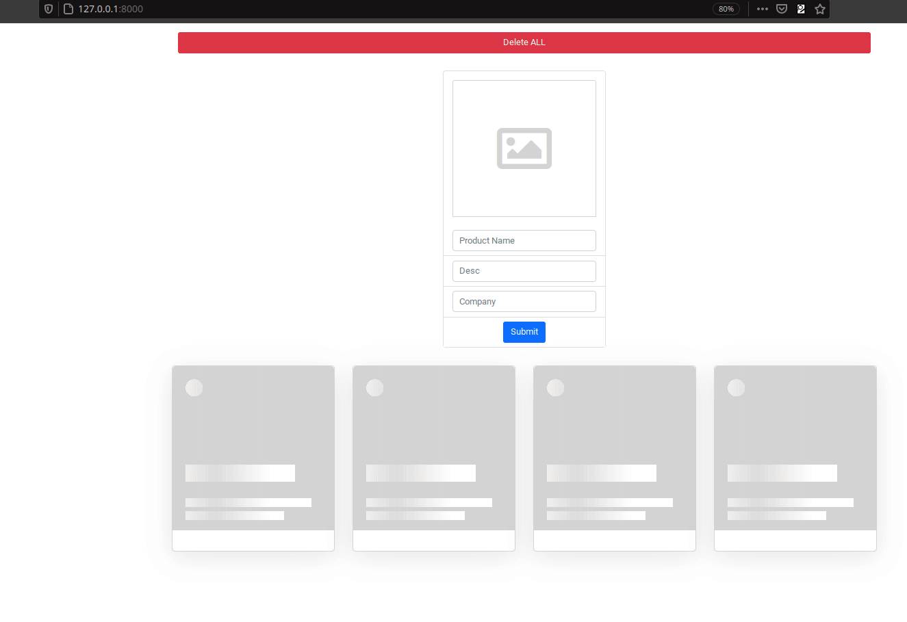

# strive-apr21-M3D9   

## "operation KV-220"

 

## DEMO: [operation-kv-220.herokuapp.com](operation-kv-220.herokuapp.com)

 

### The exercise was
- CRUD:
- [x] reading card
- [x] adding a card 
- [x] deleting all ( not all, one is protected frontend & backend )
- [x] delete a card [under the hood]
- [ ] updating card

  

### i just missed the last homework, and all needed to go wrong, gone hilariously wrong and out of hand LOL:
CHALLENGE: HACK THE DEMO

- Frontend:
    - Obfs code that protect from debug attempts
    - hand-made image uploader from scratch
    - use of imgBB APIs
    - fetching stuff with rest backend wrapper API
    - it's responsive, so also media queries for the element
    - HTML is clean micro templating 
    - the code is consistent and enough decoupled
    - layout: boostrap col system mastered
    - images managed as blobs but displayed with src attribute
    
- Backend:      
    - npm packaging for dev and prod
    - static files in public  
    - server.js as index and decoupled from routes
    - credentials in .env that is in .gitignore
    - strive token swapped with a decoy one
    - XSS protection middleware
    - 3rd party API wrapped in backend routes

### Born in aristoska, grown in the roman empire  trained in [strive.school](https://strive.school/) 

  
